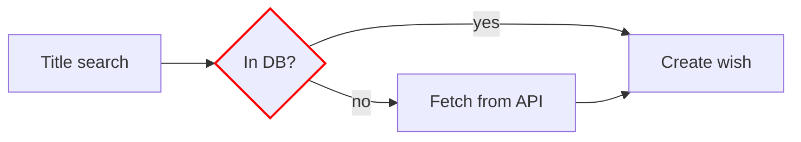
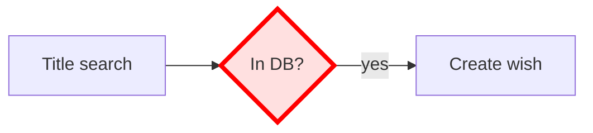

# Mermaid diagram style

This page is the canonical reference for styling Mermaid diagrams in TomeTrove documentation. For general formatting rules, see [Documentation style](documentation.md).

## Box styling

All Mermaid boxes must use **no fill and no background color** — only border colors. This keeps diagrams legible in both light and dark themes and avoids the default pastel fills that clash with the Material palette.

- **No fill, no background.** Never set `fill:` on a node. Never use `style <node> fill:#...`.
- **Border only.** Color is expressed exclusively through the border (`stroke:`). A 2 px border thickness is the maximum allowed (`stroke-width:2px`); thinner is fine, thicker is not.
- **No `classDef` with fills.** If you define a `classDef`, it must only set `stroke` and `stroke-width`, never `fill` or `background`.

## Accepted snippet

## Rejected snippet

The example below is **not allowed** — it sets a fill and a background color:

## Why

Fills bake in a light-mode assumption: a `#ffe0e0` box is invisible against a slate dark theme, and pastel fills fight the indigo accent the Material theme already uses. Borders alone adapt to both palettes and keep the diagram's information density readable.
