# Feature inventory

This is the inventory of TomeTrove's features (functionalities), grouped by subject. Each feature will eventually map to a concrete UI element — a mini-SPA, a component, or a simple button — recorded in the **Type** column. The **Contained in** column records where the feature lives (e.g. a named page, the header). Both columns are filled in as the UI is designed.

For the flows that connect these features, see the [user journeys](user-journeys/).

> [!NOTE]
> Store selection is **not** a feature in this list — it is automatic, derived from the user's preferences (currency, country, formats) intersected with store capabilities ([ADR 0013](../../explanation/adr/0013-store-integration-architecture.md)). Relevant ADRs and reference docs already document this; no user-facing action is needed.

## Types

The **Type** column classifies how a feature is delivered in the UI. The vocabulary is intentionally small and will grow as the UI is designed.

| Type          | Definition                                                                                                                                                                                                                                                                                                                                                                                                                                                                                        |
|---------------|---------------------------------------------------------------------------------------------------------------------------------------------------------------------------------------------------------------------------------------------------------------------------------------------------------------------------------------------------------------------------------------------------------------------------------------------------------------------------------------------------|
| **Mini-SPA**  | A full HTML document with its own URL and Alpine.js interactivity. Navigation to/from it is a full browser page load ([ADR 0007](../../explanation/adr/0007-frontend-delivery.md)). The primary unit of the app — each has its own endpoint, its own JS, its own state. A mini-SPA can aggregate components (e.g. the homepage aggregates summary components from wishes, watchlist, and sharing). A mini-SPA can also be a simple page that fetches and renders content (e.g. Privacy, License). |
| **Overlay**   | A transient UI layer that appears on top of the current page without a page load or a new URL. Dismissed by clicking outside, pressing Escape, or an explicit close action. Used for short, contextual content that doesn't deserve a dedicated page (e.g. notification detail). The user stays on their current page.                                                                                                                                                                            |
| **Component** | A reusable UI element embedded within a mini-SPA. Not independently routable — it lives inside a parent page. Takes input (configuration) and renders accordingly — the same component can appear in multiple contexts with different settings. Example: a sharable-wish-list component renders the full list on the dedicated page and the 3 most recent items on the homepage.                                                                                                                  |
| **Button**    | A single action element. Triggers one action (API call, navigation, confirmation dialog). The **Contained in** column records where it lives (e.g. header, a named page). Examples: delete a wish, export data, logout.                                                                                                                                                                                                                                                                           |

> [!NOTE]
> The distinction between **component** and **widget** is scope: a widget is global (header, every page), a component is local (within a specific mini-SPA). A component is not listed as a separate feature row — it is an implementation detail that emerges when the same UI logic is reused across multiple pages.

## Features

### Classified

Features grouped by subject, then by type.

#### Authentication

| # | Feature                                                                                                    | Type     | Name   | Contained in |
|---|------------------------------------------------------------------------------------------------------------|----------|--------|--------------|
| 1 | Login (GitHub OAuth via Cloudflare Access, [ADR 0006](../../explanation/adr/0006-authentication-model.md)) | Mini-SPA | login  | N/A          |
| 3 | Logout                                                                                                     | Button   | logout | header       |

#### Account

| # | Feature                                                                                               | Type     | Name           | Contained in |
|---|-------------------------------------------------------------------------------------------------------|----------|----------------|--------------|
| 4 | Export your data (JSON, [ADR 0021](../../explanation/adr/0021-data-erasure-and-export.md))            | Mini-SPA | export-data    | N/A          |
| 5 | Delete account (physical deletion, [ADR 0021](../../explanation/adr/0021-data-erasure-and-export.md)) | Mini-SPA | delete-account | N/A          |

#### Preferences

| #  | Feature                                                                                                                                                                        | Type      | Name              | Contained in          |
|----|--------------------------------------------------------------------------------------------------------------------------------------------------------------------------------|-----------|-------------------|-----------------------|
| 6  | Preferences page — mini-SPA hosting the preference components. During onboarding, acts as a 3-step wizard with progressive disclosure (step 2 hidden until step 1 saved, etc.) | Mini-SPA  | preferences       | N/A                   |
| 7  | Currency selector — dropdown of ISO 4217 currency codes, prefilled from the `currency` reference table                                                                         | Component | currency-selector | homepage, preferences |
| 39 | Country selector — dropdown of ISO 3166-1 alpha-2 country codes, prefilled from the `country` reference table                                                                  | Component | country-selector  | homepage, preferences |
| 40 | Alert threshold — percentage input (0-100), default 5. Minimum price drop to trigger notifications                                                                             | Component | alert-threshold   | homepage, preferences |
| 8  | Reading languages matrix — which languages the user reads, with optional constraints by editorial Type ([ontology](../../reference/ontology/index.md))                         | Component | reading-languages | homepage, preferences |
| 9  | Accepted formats — sortable list of 3 formats (used, new, ebook), ordered best-to-worst by drag-and-drop; formats not listed are excluded                                      | Component | accepted-formats  | homepage, preferences |
| 10 | Dark/light mode switch                                                                                                                                                         | Widget    | theme-toggle      | header                |

#### Wishes

| #  | Feature                                                                                                                                                                                                                                                                                                                                                                                                                                         | Type      | Name           | Contained in  |
|----|-------------------------------------------------------------------------------------------------------------------------------------------------------------------------------------------------------------------------------------------------------------------------------------------------------------------------------------------------------------------------------------------------------------------------------------------------|-----------|----------------|---------------|
| 11 | List wishes                                                                                                                                                                                                                                                                                                                                                                                                                                     | Mini-SPA  | list-wishes    | N/A           |
| 16 | Import wishes (CSV, [ADR 0007](../../explanation/adr/0007-frontend-delivery.md))                                                                                                                                                                                                                                                                                                                                                                | Mini-SPA  | import-wishes  | N/A           |
| 12 | Add a wish — search by title or ISBN to add a book to the wish list. Title search finds editions in the user's reading languages; ISBN search finds a specific edition and goes up to the book. A wish is for a book; acceptable editions are tracked as alternatives via `wish_edition`. Normalization via [ADR 0016](../../explanation/adr/0016-data-normalization.md). This is not a bookstore: there is no catalog to browse and pick from. | Component | add-wish       | list-wishes   |
| 13 | Search in wishes — global search field to find wishes across the user's collection, available from any authenticated page                                                                                                                                                                                                                                                                                                                       | Widget    | search-wishes  | header        |
| 14 | Search results — list of wishes matching the search query                                                                                                                                                                                                                                                                                                                                                                                       | Overlay   | search-results | search-wishes |
| 15 | Delete a wish                                                                                                                                                                                                                                                                                                                                                                                                                                   | Button    | delete-wish    | list-wishes   |

#### Sharing

| #  | Feature                                                                                                              | Type      | Name               | Contained in |
|----|----------------------------------------------------------------------------------------------------------------------|-----------|--------------------|--------------|
| 22 | Create sharable wish lists ([ADR 0017](../../explanation/adr/0017-public-wish-list-sharing.md))                      | Mini-SPA  | create-share       | N/A          |
| 23 | View sharable wish lists (owner's management view)                                                                   | Mini-SPA  | view-shares        | N/A          |
| 35 | Shared list detail — mini-SPA for viewing and managing a single shared list                                          | Mini-SPA  | shared-list        | N/A          |
| 25 | Rename sharable wish list (token and URL stay the same; only the label changes)                                      | Component | rename-share       | shared-list  |
| 24 | Preview wish list (see the share page as a visitor would)                                                            | Button    | preview-share      | shared-list  |
| 26 | Remove item(s) from sharable wish list                                                                               | Button    | remove-share-items | shared-list  |
| 27 | Delete sharable wish lists (revoke, [ADR 0017](../../explanation/adr/0017-public-wish-list-sharing.md))              | Button    | delete-share       | view-shares  |
| 28 | Public list view (visitor side, unauthenticated, [ADR 0017](../../explanation/adr/0017-public-wish-list-sharing.md)) | Mini-SPA  | public-list-view   | N/A          |

#### Watchlist

| #  | Feature                                                                                                                                                                                                                           | Type     | Name            | Contained in                                                       |
|----|-----------------------------------------------------------------------------------------------------------------------------------------------------------------------------------------------------------------------------------|----------|-----------------|--------------------------------------------------------------------|
| 18 | View my watchlist                                                                                                                                                                                                                 | Mini-SPA | view-watchlist  | N/A                                                                |
| 20 | Wish detail — mini-SPA showing price history graphs and the quote component. Reached from the watchlist (monitoring) or from on-demand fetch (quoting a specific wish)                                                            | Mini-SPA | wish-detail     | N/A                                                                |
| 17 | Put a wish in my watchlist (elect for monitoring, [ADR 0014](../../explanation/adr/0014-scheduled-price-fetching.md))                                                                                                             | Button   | elect-watchlist | list-wishes                                                        |
| 19 | Delete a wish from my watchlist (stop monitoring)                                                                                                                                                                                 | Button   | unwatch-wish    | view-watchlist                                                     |
| 21 | On-demand price fetch (1-hour cooldown, [ADR 0014](../../explanation/adr/0014-scheduled-price-fetching.md)) — button present wherever wishes appear; clicking navigates to `wish-detail` where the quote component runs the fetch | Button   | on-demand-fetch | list-wishes, search-results, view-watchlist, shared-list, homepage |

#### Notifications

| #  | Feature                                                                       | Type    | Name                | Contained in  |
|----|-------------------------------------------------------------------------------|---------|---------------------|---------------|
| 29 | Notifications list ([ADR 0015](../../explanation/adr/0015-alert-delivery.md)) | Widget  | notifications       | header        |
| 30 | Notification detail                                                           | Overlay | notification-detail | notifications |
| 31 | Mark all notifications as read                                                | Button  | mark-all-read       | notifications |

#### Legal & meta

| #  | Feature                                                                                                                                                                                                                                         | Type     | Name         | Contained in |
|----|-------------------------------------------------------------------------------------------------------------------------------------------------------------------------------------------------------------------------------------------------|----------|--------------|--------------|
| 32 | Homepage — login/landing when unauthenticated; dashboard when authenticated. Aggregates summary components: recent wishes, watchlist overview, 3 most recent sharable lists, latest alerts. Click-through to dedicated pages for the full view. | Mini-SPA | homepage     | N/A          |
| 33 | Privacy (view privacy policy, [PRIVACY](https://github.com/Zolletta/TomeTrove/blob/main/PRIVACY.md))                                                                                                                                            | Mini-SPA | privacy      | N/A          |
| 34 | License (view license, [LICENSE](https://github.com/Zolletta/TomeTrove/blob/main/LICENSE))                                                                                                                                                      | Mini-SPA | license      | N/A          |
| 2  | Header — global widget present on every authenticated page; hosts `logout`, `theme-toggle`, `notifications`, `search-wishes`                                                                                                                    | Widget   | header       | \<all\>      |
| 36 | Footer — global widget present on every page; hosts links to `privacy` and `license`                                                                                                                                                            | Widget   | footer       | \<all\>      |
| 37 | Link to privacy page                                                                                                                                                                                                                            | Button   | privacy-link | footer       |
| 38 | Link to license page                                                                                                                                                                                                                            | Button   | license-link | footer       |

> [!NOTE]
> The preference components (7, 39, 40, 8, 9) appear on two mini-SPAs: `homepage` (#32, as summary widgets) and `preferences` (#6, as full forms). During onboarding, `preferences` acts as a 3-step wizard with progressive disclosure: step 1 (currency, country, alert threshold) → step 2 (reading languages) → step 3 (accepted formats). Each component manages its own state and save logic. The dark/light toggle (10, `theme-toggle`) is a widget in the `header` (#2), not part of the Preferences page.

> [!NOTE]
> The Privacy and License pages are mini-SPAs that fetch and render the content of [`PRIVACY.md`](https://github.com/Zolletta/TomeTrove/blob/main/PRIVACY.md) and [`LICENSE`](https://github.com/Zolletta/TomeTrove/blob/main/LICENSE) in a styled, readable layout.

## Section tree

Features grouped by subject, then by type.

```mermaid
graph LR
    root[TomeTrove]

    root --> Auth[Authentication]
    Auth --> login[login<br/>Mini-SPA]
    Auth --> logout[logout<br/>Button]

    root --> Account[Account]
    Account --> export[export-data<br/>Mini-SPA]
    Account --> del[delete-account<br/>Mini-SPA]

    root --> Prefs[Preferences]
    Prefs --> prefpage[preferences<br/>Mini-SPA]
    Prefs --> currency[currency-selector<br/>Component]
    Prefs --> country[country-selector<br/>Component]
    Prefs --> threshold[alert-threshold<br/>Component]
    Prefs --> reading[reading-languages<br/>Component]
    Prefs --> formats[accepted-formats<br/>Component]
    Prefs --> theme[theme-toggle<br/>Widget]

    root --> Wishes[Wishes]
    Wishes --> listw[list-wishes<br/>Mini-SPA]
    Wishes --> importw[import-wishes<br/>Mini-SPA]
    Wishes --> addw[add-wish<br/>Component]
    Wishes --> searchw[search-wishes<br/>Widget]
    Wishes --> searchr[search-results<br/>Overlay]
    Wishes --> delw[delete-wish<br/>Button]

    root --> Sharing[Sharing]
    Sharing --> creates[create-share<br/>Mini-SPA]
    Sharing --> views[view-shares<br/>Mini-SPA]
    Sharing --> sharedl[shared-list<br/>Mini-SPA]
    Sharing --> renames[rename-share<br/>Component]
    Sharing --> previews[preview-share<br/>Button]
    Sharing --> removes[remove-share-items<br/>Button]
    Sharing --> deletes[delete-share<br/>Button]
    Sharing --> publicv[public-list-view<br/>Mini-SPA]

    root --> Watch[Watchlist]
    Watch --> vieww[view-watchlist<br/>Mini-SPA]
    Watch --> wishd[wish-detail<br/>Mini-SPA]
    Watch --> elect[elect-watchlist<br/>Button]
    Watch --> unwatch[unwatch-wish<br/>Button]
    Watch --> ondemand[on-demand-fetch<br/>Button]

    root --> Notif[Notifications]
    Notif --> notiflist[notifications<br/>Widget]
    Notif --> notifdetail[notification-detail<br/>Overlay]
    Notif --> markall[mark-all-read<br/>Button]

    root --> Meta[Legal & meta]
    Meta --> homep[homepage<br/>Mini-SPA]
    Meta --> priv[privacy<br/>Mini-SPA]
    Meta --> lic[license<br/>Mini-SPA]
    Meta --> header[header<br/>Widget]
    Meta --> footer[footer<br/>Widget]
    Meta --> privlink[privacy-link<br/>Button]
    Meta --> liclink[license-link<br/>Button]

    classDef auth stroke:#e6194b,stroke-width:2px,fill:none
    classDef account stroke:#3cb44b,stroke-width:2px,fill:none
    classDef prefs stroke:#ffe119,stroke-width:2px,fill:none
    classDef wishes stroke:#4363d8,stroke-width:2px,fill:none
    classDef sharing stroke:#f58231,stroke-width:2px,fill:none
    classDef watch stroke:#911eb4,stroke-width:2px,fill:none
    classDef notif stroke:#42d4f4,stroke-width:2px,fill:none
    classDef meta stroke:#000000,stroke-width:2px,fill:none

    class Auth,login,logout auth
    class Account,export,del account
    class Prefs,prefpage,currency,country,threshold,reading,formats,theme prefs
    class Wishes,listw,importw,addw,searchw,searchr,delw wishes
    class Sharing,creates,views,sharedl,renames,previews,removes,deletes,publicv sharing
    class Watch,vieww,wishd,elect,unwatch,ondemand watch
    class Notif,notiflist,notifdetail,markall notif
    class Meta,homep,priv,lic,header,footer,privlink,liclink meta
```

## Site structure

Containment tree — how features nest inside each other. Mini-SPAs are top-level nodes (N/A in Contained in); everything else is nested under its container.

```mermaid
graph TD
    %% Top-level mini-SPAs
    login[login]
    export[export-data]
    del[delete-account]
    prefpage[preferences]
    listw[list-wishes]
    importw[import-wishes]
    vieww[view-watchlist]
    wishd[wish-detail]
    creates[create-share]
    views[view-shares]
    sharedl[shared-list]
    publicv[public-list-view]
    homep[homepage]
    priv[privacy]
    lic[license]

    %% Global widgets
    header[header<br/>Widget on every auth page]
    footer[footer<br/>Widget on every page]

    %% Header contents
    header --> logout[logout]
    header --> theme[theme-toggle]
    header --> searchw[search-wishes]
    header --> notiflist[notifications]

    %% Footer contents
    footer --> privlink[privacy-link]
    footer --> liclink[license-link]

    %% Preferences page contents
    prefpage --> currency[currency-selector]
    prefpage --> country[country-selector]
    prefpage --> threshold[alert-threshold]
    prefpage --> reading[reading-languages]
    prefpage --> formats[accepted-formats]

    %% Homepage contents (summary components)
    homep --> currency
    homep --> country
    homep --> threshold
    homep --> reading
    homep --> formats
    homep --> ondemand[on-demand-fetch]

    %% Wishes page contents
    listw --> addw[add-wish]
    listw --> delw[delete-wish]
    listw --> elect[elect-watchlist]
    listw --> ondemand

    %% Search overlay
    searchw --> searchr[search-results]
    searchr --> ondemand

    %% Watchlist page contents
    vieww --> unwatch[unwatch-wish]
    vieww --> ondemand

    %% Shared list page contents
    sharedl --> renames[rename-share]
    sharedl --> previews[preview-share]
    sharedl --> removes[remove-share-items]
    sharedl --> ondemand

    %% Notifications widget contents
    notiflist --> notifdetail[notification-detail]
    notiflist --> markall[mark-all-read]

    %% View-shares page contents
    views --> deletes[delete-share]

    %% on-demand-fetch navigates to wish-detail
    ondemand -.->|navigates to| wishd

    classDef auth stroke:#e6194b,stroke-width:2px,fill:none
    classDef account stroke:#3cb44b,stroke-width:2px,fill:none
    classDef prefs stroke:#ffe119,stroke-width:2px,fill:none
    classDef wishes stroke:#4363d8,stroke-width:2px,fill:none
    classDef sharing stroke:#f58231,stroke-width:2px,fill:none
    classDef watch stroke:#911eb4,stroke-width:2px,fill:none
    classDef notif stroke:#42d4f4,stroke-width:2px,fill:none
    classDef meta stroke:#000000,stroke-width:2px,fill:none

    class login,logout auth
    class export,del account
    class prefpage,currency,country,threshold,reading,formats,theme prefs
    class listw,importw,addw,searchw,searchr,delw wishes
    class creates,views,sharedl,renames,previews,removes,deletes,publicv sharing
    class vieww,wishd,elect,unwatch,ondemand watch
    class notiflist,notifdetail,markall notif
    class homep,priv,lic,header,footer,privlink,liclink meta
```

