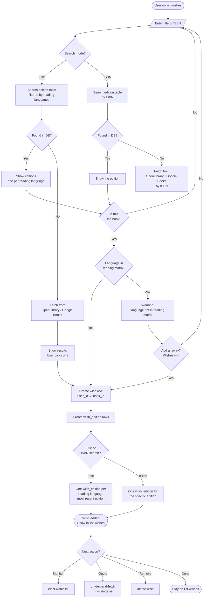
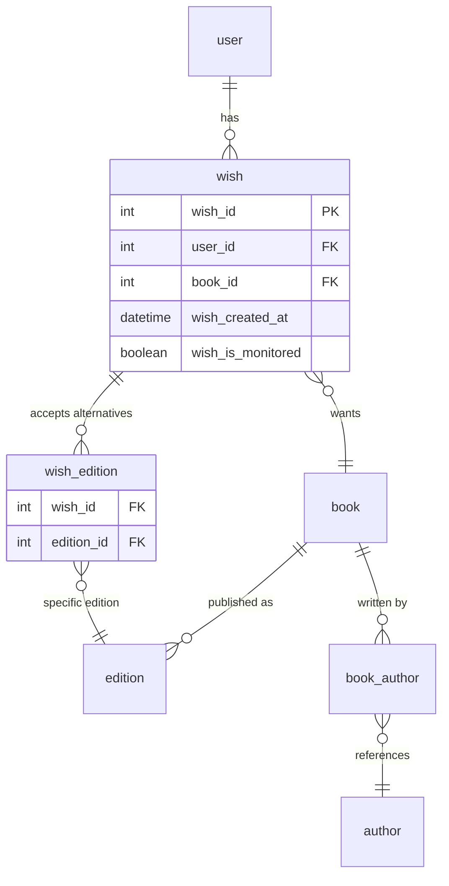

# Add a wish

The core value-creating action: searching for a book and adding it to the wish list. This is the action users will repeat most, so friction here compounds.

## Goal

Find a book by searching its title or ISBN, and add it to the wish list. A wish is for a **book**, not an edition — the user wants the book, and the system tracks acceptable editions as alternatives.

## Preconditions

- The user is authenticated.
- The user has set their preferences (currency, country, reading languages, accepted formats) — see [onboarding](onboarding.md).
- The user is on `list-wishes` (or navigates there from `homepage`).

## Steps

1. **`list-wishes`** — The user sees their current wish list (possibly empty). The `add-wish` component is visible (a search field with a toggle: "Search by title" or "Search by ISBN").

2. **`add-wish`** (component within `list-wishes`) — The user enters a title or an ISBN. The two paths differ:

### Path A: title search

3a. **DB lookup** — The system searches the `edition` table for editions matching the title, filtered to languages the user reads (per the edition filtering rule: most recent edition per language where the language is in the user's reading matrix and allowed for the book's Type).

4a. **Found in DB** — Results are shown (one per language the user reads). Each result shows: edition title, author, language, publisher, year. The user is asked: "Is this the book?"
   - **Yes** → go to step 6.
   - **No** → go to step 3b (fetch from external API).

5a. **Not found in DB** — The system fetches from OpenLibrary / Google Books ([ADR 0004](../../../explanation/adr/0004-book-metadata-source.md)) by title. Results are shown. The user picks one. The system creates the `book`, `edition`, and `author` rows (if not already present) and normalizes the author via the alias table per [ADR 0016](../../../explanation/adr/0016-data-normalization.md). Then go to step 6.

### Path B: ISBN search

3b. **DB lookup** — The system searches the `edition` table for an edition with the given ISBN. ISBN maps to exactly one edition.

4b. **Found in DB** — The edition is shown (title, author, language, publisher, year). The system goes up to the parent `book_id`. The user is asked: "Is this the book?"
   - **Yes** → go to step 6.
   - **No** → restart the search (the ISBN was wrong or the user changed their mind).

5b. **Not found in DB** — The system fetches from OpenLibrary / Google Books by ISBN. The API returns one edition with full metadata. The system creates the `book`, `edition`, and `author` rows (if not already present), normalizes the author per [ADR 0016](../../../explanation/adr/0016-data-normalization.md). Then go to step 6.

### Converge: create the wish

6. **Create wish** — One `wish` row is created linking `user_id` to `book_id`. The `wish_edition` junction is populated:
   - **Title search**: one `wish_edition` row per language the user reads (the most recent edition per language). These are **alternatives** — the user wants one copy, in any of these editions.
   - **ISBN search**: one `wish_edition` row for the specific edition found via ISBN.

7. **`list-wishes`** — The wish list now shows the new entry, grouped by book. The user sees options:
   - `delete-wish` — remove the book from the wish list (deletes the `wish` and all its `wish_edition` rows)
   - `elect-watchlist` — start monitoring the book's price (max 5 monitored books)
   - `on-demand-fetch` — get an immediate price quote (navigates to `wish-detail`)

## Branches

### Language mismatch (ISBN search)

6a. The user enters an ISBN for an edition in a language not in their reading matrix. A warning is shown: "This edition is in {language}, which is not in your reading languages. Add anyway?" The user can confirm or cancel. **Wishes win** — if the user confirms, the edition is added to `wish_edition` regardless of the reading matrix.

### Book already in the wish list

6b. The book is already in the user's wish list (detected by `(user_id, book_id)` unique constraint). This can only happen when searching by ISBN (title search already adds all editions in the user's reading languages). If the ISBN corresponds to a different edition than the one in the existing wish, the user sees: "This book is already in your wish list with a different edition. Replace the current edition with this one?" The user can accept (replace the `wish_edition` row) or cancel (keep the existing edition).

### No results from external API

5c. Neither the DB nor the external API returns results. The user sees: "No books found for '{query}'. Try a different title or ISBN."

## End state

- The user has added a book to their wish list.
- The `wish` row links the user to the book.
- The `wish_edition` rows list the acceptable editions (alternatives).
- The user can now `elect-watchlist`, `on-demand-fetch`, or `delete-wish`.

## Resolved questions

- **Search UX:** ISBN search waits for the user to finish typing (submit-on-enter, no autocomplete — too noisy for a 10/13-digit number). Title search uses autocomplete: results appear after at least 3 characters, debounced so it doesn't fire while the user is actively typing.
- **External API timeout:** if OpenLibrary/Google Books is slow or down, the user sees: "Could not reach the book service. Please try again later." No retry for now — a later phase may add automatic retry with backoff.
- **Adding editions to an existing wish:** this can only happen when searching by ISBN (title search already adds all editions in the user's reading languages). If the ISBN search finds a book already in the wish list but with a different edition, the UI offers to switch: "This book is already in your wish list with a different edition. Replace the current edition with this one?" The user can accept (replace the `wish_edition` row) or cancel (keep the existing edition).

## Open questions

(none)

## Flow diagram

## Data created

