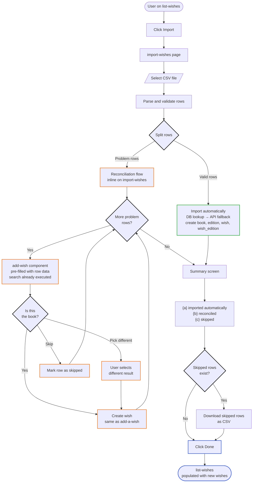
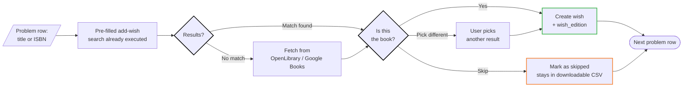

# CSV import

Bulk import wishes from a CSV file. This is a shortcut for users who already have a list of books elsewhere (spreadsheet, another app's export) and want to populate their wish list in one action.

## Goal

Import multiple wishes from a CSV file. Valid rows are imported automatically; problem rows are reconciled one-by-one through the same `add-wish` UI the user already knows.

## Preconditions

- The user is authenticated.
- The user has set their preferences (currency, country, reading languages, accepted formats) — see [onboarding](onboarding.md).
- The user is on `list-wishes` and clicks "Import" to navigate to `import-wishes`.

## Steps

1. **`import-wishes`** — The user sees:
   - A file upload area (drag-and-drop or file picker)
   - A description of the expected CSV format (columns: `isbn`, `title`, `author` — at least one of `isbn` or `title` must be present; `author` is optional)
   - A link to download a template CSV

2. **Select and upload** — The user selects a CSV file. The file is uploaded and parsed.

3. **Validation** — Each row is validated:
   - At least one of `isbn` or `title` is present?
   - ISBN is well-formed (10 or 13 digits)?
   - No obvious structural issues (wrong column count, unreadable encoding)?

4. **Split** — Rows are split into two groups:
   - **Valid rows** — imported automatically, no preview, no confirmation. The system processes each one: DB lookup → external API fallback if needed → create `book`, `edition`, `wish`, `wish_edition` rows (same logic as [add-a-wish](add-a-wish.md)).
   - **Problem rows** — rows with validation errors, ambiguous matches, or missing data. These enter the reconciliation flow (step 5).

5. **Reconciliation flow** — The problem rows are processed one at a time, inline on the `import-wishes` page. For each row, the `add-wish` component is pre-filled with the row's data (title or ISBN) and the search is executed automatically. The user sees the same "Is this the book?" confirmation as add-a-wish, with the initial search already done.

   For each row, the user can:
   - **Confirm** — accept the match, create the wish (same as add-a-wish step 6)
   - **Pick a different result** — if the search returned multiple results, the user can select a different one
   - **Skip** — leave the row unresolved. It stays in the downloadable CSV for manual fix later.

   A progress indicator shows: "Reconciling row {n} of {m}. {x} resolved, {y} skipped."

6. **Summary** — After all rows are processed (imported or skipped), the user sees a summary:
   - "{a} wishes imported automatically"
   - "{b} wishes reconciled via UI"
   - "{c} rows skipped — download CSV"
   - A "Download skipped rows" button generates a CSV with the unresolved rows

7. **`list-wishes`** — The user clicks "Done" and is redirected to the wish list, now populated with the imported wishes.

## Branches

### File too large

2a. The file exceeds a size limit. The user sees: "File too large. Maximum {size}. Try splitting into smaller files."

### All rows valid

4a. No problem rows — the reconciliation flow is skipped. The summary shows only the count of imported wishes, and the user goes straight to `list-wishes`.

### All rows problematic

4b. No valid rows — nothing is imported automatically. The user enters the reconciliation flow for all rows. If they skip all of them, the summary offers the downloadable CSV with all rows.

## End state

- Valid rows are imported as wishes (with `wish_edition` alternatives, same as add-a-wish).
- Reconciled rows are imported as wishes.
- Skipped rows are available as a downloadable CSV.
- The user is on `list-wishes` with the newly imported wishes visible.

## Open questions

- **Client-side vs server-side parsing:** does the CSV parsing happen in the browser (Alpine.js) or on the Worker? Client-side avoids a round trip but has size limits.
- **Template:** should we provide a downloadable CSV template? What columns?

## Flow diagram

## Reconciliation loop detail

