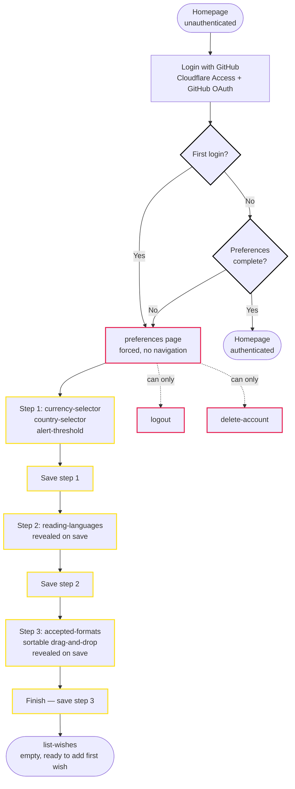

# Onboarding

The first-run journey: from landing on the site as a new visitor to having preferences configured and a first wish. Preferences are mandatory — the app cannot function without currency, country, and reading languages (store selection depends on them per [ADR 0013](../../../explanation/adr/0013-store-integration-architecture.md)).

## Goal

Get a new user from zero to configured preferences and their first wish, as quickly as possible.

## Preconditions

- The user has never logged in.
- The user has no wishes, no watchlist, no preferences, no shared lists.

## Steps

1. **`homepage` (unauthenticated)** — The user lands on the homepage. Since they are not authenticated, they see a login/landing page with a "Login with GitHub" button and a brief description of what TomeTrove does. The `header` and `footer` are not shown (or shown in a minimal form without authenticated actions).

2. **`login`** — The user clicks "Login with GitHub". Cloudflare Access handles the OAuth flow with GitHub per [ADR 0006](../../../explanation/adr/0006-authentication-model.md). On success, the user is redirected to the app.

3. **First login → forced `preferences`** — On the first successful login, the user is redirected directly to the `preferences` page. They cannot navigate elsewhere until preferences are saved. The only other actions available are `logout` (header) and a link to `delete-account`.

4. **`preferences` (3-step wizard)** — The preferences page presents 3 steps with progressive disclosure: all steps are on the same page, but step 2 is hidden until step 1 is saved, and step 3 is hidden until step 2 is saved. No separate pages, no navigation — just reveal-on-complete.

   **Step 1: Currency, country, and alert threshold**
   - `currency-selector` — dropdown of ISO 4217 currency codes (e.g. EUR, USD, GBP), prefilled from the `currency` reference table. The user selects their preferred currency.
   - `country-selector` — dropdown of ISO 3166-1 alpha-2 country codes (e.g. IT, US, DE), prefilled from the `country` reference table. The user selects their country (determines which stores ship to them).
   - `alert-threshold` — percentage input (0-100). Default 5. The user sets the minimum price drop percentage to trigger notifications.
   - A "Continue" button saves step 1 and reveals step 2.

   **Step 2: Reading languages**
   - `reading-languages` — the user selects which languages they read, with optional constraints by editorial Type (e.g. "I read Italian in all Types, but English only in Fiction and Essay"). One language is marked as preferred.
   - A "Continue" button saves step 2 and reveals step 3.

   **Step 3: Accepted formats**
   - `accepted-formats` — a sortable list of the 3 formats (used, new, ebook), ordered best-to-worst by drag-and-drop. Formats not listed are excluded. The user reorders the list.
   - A "Finish" button saves step 3 and redirects to `homepage`.

5. **`list-wishes`** — After saving preferences, the user is redirected directly to the wish list page (empty). They proceed to the [add-a-wish journey](add-a-wish.md).

## Subsequent logins with unfilled preferences

If a user logs in and their preferences are not fully set (e.g. they abandoned the wizard mid-way), they are redirected to `preferences` again. Since each step saves independently, previously completed steps are already persisted — the user resumes from the first incomplete step. The only actions available are:
- `logout` (header)
- Link to `delete-account`

They cannot access any other page until all preferences are complete. This is a hard block, not a soft prompt — the app cannot select stores or fetch prices without currency, country, and reading languages.

## End state

- The user is authenticated.
- Preferences are fully configured (currency, country, alert threshold, reading languages, accepted formats).
- The user is on `list-wishes` ready to add their first wish.

## Post-onboarding preference editing

After onboarding, the `preferences` page shows all 3 steps expanded (no wizard sequence). The user can edit any individual preference component independently — each component has its own save button and manages its own state.

## Open questions

(none)

## Flow diagram

