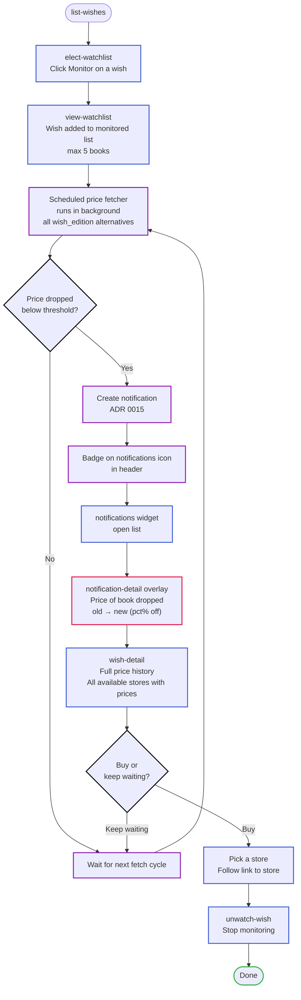
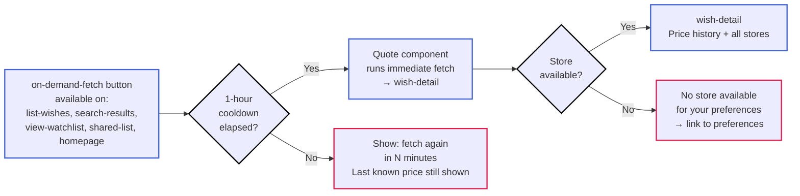

# Price monitoring loop

The core retention mechanic: electing a wish for monitoring, receiving price-drop notifications, and acting on them. This is why users come back to the app.

## Goal

Keep the user engaged over time by alerting them when a wished book's price drops below their threshold. A wish is for a book; the system monitors all acceptable editions (listed in `wish_edition` as alternatives) and alerts the user when a price drops on any of them.

## Preconditions

- The user is authenticated.
- The user has at least one wish in `list-wishes`.
- The user has set `user-preference` (currency, country, alert threshold percentage) — the system needs these to select a store and compute the threshold ([ADR 0013](../../../explanation/adr/0013-store-integration-architecture.md)).

## Steps

1. **`elect-watchlist`** (button within `list-wishes`) — The user clicks "Monitor" next to a wish. The wish is added to the watchlist. Scheduled price fetching begins per [ADR 0014](../../../explanation/adr/0014-scheduled-price-fetching.md).

2. **`view-watchlist`** — The user can visit the watchlist page to see all monitored wishes with their latest known prices and price history.

3. **`wish-detail`** — The user clicks a wish in the watchlist to see its detail page: price history graphs and the quote component. From here they can also trigger `on-demand-fetch` (subject to the 1-hour cooldown).

4. **Wait** — The scheduled fetcher runs in the background. When a price drops below the user's threshold percentage, a notification is created per [ADR 0015](../../../explanation/adr/0015-alert-delivery.md).

5. **`notifications`** (widget in `header`) — A badge appears on the notifications icon. The user clicks it to open the notifications list.

6. **`notification-detail`** (overlay within `notifications`) — The user reads the alert: "The price of {book} dropped from {old price} to {new price} ({percentage}% off)."

7. **`wish-detail`** — The user clicks through from the notification to the wish detail page to see the full price history and decide whether to buy.

8. **`unwatch-wish`** (button within `view-watchlist`) — If the user buys the book or loses interest, they can stop monitoring.

## Branches

### On-demand fetch (no notification yet)

3a. The user doesn't want to wait for the scheduled fetch. They click `on-demand-fetch` (available wherever wishes appear: `list-wishes`, `search-results`, `view-watchlist`, `shared-list`, `homepage`). This navigates to `wish-detail` where the quote component runs an immediate fetch, subject to the 1-hour cooldown per [ADR 0014](../../../explanation/adr/0014-scheduled-price-fetching.md).

### Cooldown active

3b. The user clicks `on-demand-fetch` but the 1-hour cooldown hasn't elapsed. The user sees a message: "You can fetch again in {minutes} minutes." The last known price is still shown.

### No store available

3c. The user's preferences (currency, country, formats) don't match any store's capabilities per [ADR 0013](../../../explanation/adr/0013-store-integration-architecture.md). The user sees: "No store available for your preferences. Try changing your currency, country, or accepted formats." → links to `preferences`.

## End state

- The user has monitored a wish, received a price-drop alert, and either bought the book or decided to keep waiting.
- The loop can repeat indefinitely for other wishes.

## Resolved questions

- **Notification action:** the user goes through `wish-detail` — the notification links to the wish detail page, where they see the full price history and the links to all available stores. No "Buy now" directly from the notification.
- **Threshold default:** the default is 5% (already set in the `alert-threshold` component during onboarding). Electing for the watchlist is not blocked — the threshold is always set (either the default or the user's chosen value).
- **Multiple stores:** if multiple stores match the user's preferences, the notification links to `wish-detail` where all available stores are listed with their prices. The user picks which store to buy from.

## Open questions

(none)

## Flow diagram

## On-demand fetch branch

