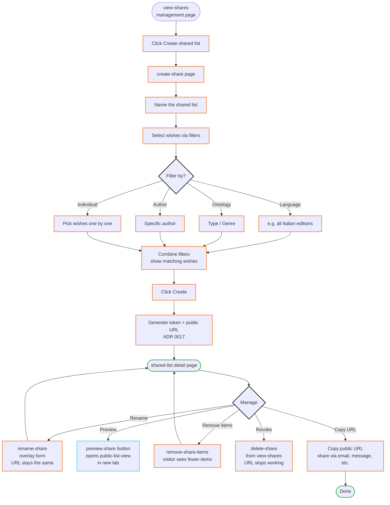
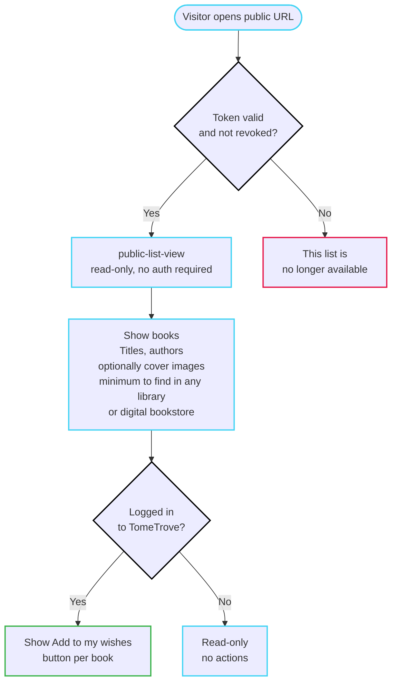

# Sharing

Create a shared wish list and share it with a visitor via a public link. This journey has two sides: the owner (authenticated) and the visitor (unauthenticated).

## Goal

Let a user share a subset of their wish list with someone who doesn't have a TomeTrove account, via a public URL.

## Preconditions

- The user is authenticated.
- The user has at least one wish in `list-wishes`.

## Steps — owner side

1. **`view-shares`** — The user navigates to the shared lists management page. They see their existing shared lists (if any) with options: `delete-share`, and a link to each `shared-list` detail.

2. **`create-share`** — The user clicks "Create shared list". They are taken to the create page (a dedicated mini-SPA) where they:
   - Name the shared list (a label for their own reference)
   - Select which wishes to include via filters: by language (e.g. "all Italian editions"), by ontology Type/Genre, by author, or individual selection. Multiple filters can be combined.
   - Click "Create"

   A token is generated and a public URL is created per [ADR 0017](../../../explanation/adr/0017-public-wish-list-sharing.md).

3. **`shared-list`** — The user lands on the shared list detail page. They see:
   - The shared list name
   - The public URL (copyable)
   - The included wishes
   - Options: `rename-share`, `preview-share`, `remove-share-items`

4. **`preview-share`** (button within `shared-list`) — The user clicks "Preview" to see the shared list as a visitor would see it. This opens `public-list-view` (in a new tab or overlay).

5. **Share the link** — The user copies the public URL and sends it to their friend via whatever channel (email, message, etc.).

## Steps — visitor side

6. **`public-list-view`** — The visitor opens the public URL. They see:
   - The shared list (read-only)
   - The books with their titles, authors, and optionally cover images — the minimum to find the book in any library or digital bookstore
   - No prices, no formats, no TomeTrove-specific data

   **Branch: visitor is logged in to TomeTrove** — if the visitor has an active TomeTrove session, they see an "Add to my wishes" button next to each book. If not logged in, the list is read-only with no actions.

   **Branch: invalid or revoked link** — If the token is invalid or the list has been revoked (`delete-share`), the visitor sees: "This list is no longer available."

## Branches — owner side

### Rename

3a. **`rename-share`** (component within `shared-list`) — The user clicks "Rename", an overlay form appears, they type a new name and save. The token and URL stay the same; only the label changes.

### Remove items

3b. **`remove-share-items`** (button within `shared-list`) — The user removes one or more wishes from the shared list. The public URL stays the same, but the visitor will see fewer items on next visit.

### Revoke

3c. **`delete-share`** (button within `view-shares`) — The user revokes the shared list entirely. The public URL stops working immediately. The visitor will see "This list is no longer available."

## End state

- The owner has a shared list with a public URL.
- The visitor can view the list without an account.
- The owner can manage (rename, remove items, revoke) at any time.

## Resolved questions

- **What the visitor sees:** the minimum to find the book in any library or digital bookstore — title, author, and optionally cover image. No prices, no formats, no TomeTrove-specific data.
- **Authentication wall:** truly unauthenticated. The public list is public — no Cloudflare Access, no shared password. The data shown is not personal (just book titles and authors).
- **Multiple shared lists:** the same wish can appear in multiple shared lists. The same set of wishes can be shared with different names/URLs.
- **Visitor actions:** if the visitor is logged in to TomeTrove, they see an "Add to my wishes" button next to each book. If not logged in, they see a read-only list with no actions.

## Open questions

(none)

## Flow diagram — owner side

## Flow diagram — visitor side

