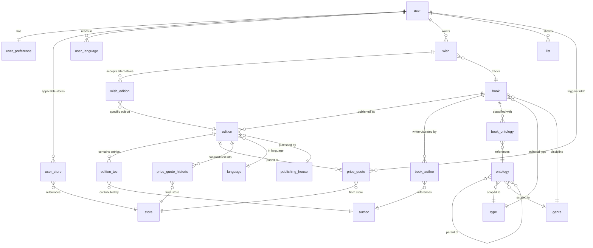

# Data model

This page explains *why* the TomeTrove data model is shaped the way it is — the entity boundaries, the relationships, and the data flows. For the bare table and field listings, see the [data model reference](../reference/data-model.md). If the explanation and the reference ever disagree, the reference wins.

## Overview

TomeTrove is a book collection manager with multi-store price tracking and alerts. Users maintain a list of books they want to buy; the system tracks prices across multiple stores over time and alerts users when a book hits a low price.

## Entity boundaries

### Book vs Edition

A `Book` is a work, not a specific physical publication — "Hamlet" is one book with multiple editions. This separation lets the system track the same work across translations, formats, and publishers without duplicating the core metadata (title, author, classification). An `Edition` is a concrete published version: a specific language, publisher, ISBN, and year.

### Author and Curator as a shared pool

Authors and curators come from the same `author` table. A book has at least one author OR at least one curator. The relationship is ordered (first author is primary). This avoids maintaining two parallel tables for what is essentially the same kind of entity — a person responsible for the content. The `book_author_role` field (`author` or `curator`) distinguishes the relationship, not the entity.

Author names are stored in two forms: `author_name_latin` (romanized, "Surname, Firstname" — always present, used for sorting and default display) and `author_name_original` (the name in the original script, e.g. "Толстой, Лев" — null for Latin-script authors). The `author_original_language_id` field drives display: the original form is shown only when the user's UI language matches the author's original language; otherwise the latin form is used. Author names are intrinsic data, not translations — they do not live in the `translation` table. Aliases (`author_aliases`) are search-match targets for the normalization pipeline, not display names. The `author` table is pre-loaded from Wikidata ([ADR 0016](adr/0016-data-normalization.md)), following the rules in the [author normalization reference](../reference/author-normalization.md), so most authors already exist when a user enters a name — the user picks from autocomplete suggestions rather than typing a name from scratch.

### Edition TOC vs Book Author

Anthologies and collections have a table of contents (`edition_toc`) where each entry is a contribution by an author or curator, with a translated title. Single-author books do not use `edition_toc` — they use `book_author` directly. The split exists because anthology entries are edition-specific (the selection and its title vary by edition), while authorship is book-level (the authors of a single-author work don't change per edition).

### User preferences and store applicability

User preferences (`user_preference`) drive which editions are listed and which stores are queried for each different user. The `user_store` junction pre-computes which stores are applicable for a user by intersecting the user's currency, country, and format preferences against store capabilities. This avoids scanning and parsing JSON arrays on every price fetch — MySQL (TiDB) JSON columns cannot be indexed for array-membership intersection. The junction is rebuilt for a single user when their preferences change, and for all users when a store is added or modified. The per-edition language filter (`store_languages` vs the edition's language) is still applied at fetch time, since it depends on the edition, not the user.

### Classification: Type + Genre + tags

The classification system (defined by [ADR 0018](adr/0018-ontology-data-model.md) and documented in the [ontology reference](../reference/ontology/index.md)) replaces a single genre tree with a **Type + Genre + tags** model. A book has one Type (one of 9 editorial types) and one Genre (a discipline/subject), plus 0..N ontology tags that capture the deeper hierarchy levels. Each entity table (`type`, `genre`, `ontology`) stores the canonical English name in a `_en` field (`type_name_en`, `genre_name_en`, `ontology_name_en`). Non-English translations live in a unified `translation` table keyed by `(table_name, entity_id, language_id)` — see [ADR 0019](adr/0019-ontology-i18n.md). The fallback chain when a translation is missing: `translation` table → entity's `_en` field (always populated at seed time). UI string internationalization is a separate, file-based concern — see [ADR 0022](adr/0022-ui-string-i18n.md).

### Price quotes and historic consolidation

A `price_quote` is a snapshot of an edition's price at a specific store on a specific date. On-demand fetches keep only the latest price per (edition, store). For monitored books, all price attempts during the month are saved and consolidated at month-end into `price_quote_historic` (min, max, mean per edition/store). Raw rows are deleted after consolidation. Baseline quotes (the first fetch when a book is marked as monitored) are preserved — they are used for alert calculations, not for historic trends. The baseline is refreshed to the most recent month's historic mean after 12 months, correcting for inflation and list-price drift on long-tracked books ([ADR 0014](adr/0014-scheduled-price-fetching.md)).

## Data flows

### Wish list add

User adds a book to their wish list by entering a title or an ISBN.

**Title search**: the system searches the `edition` table for editions matching the title in languages the user reads. If found, the user confirms ("Is this the book?"). If not found, the system fetches from OpenLibrary/Google Books ([ADR 0004](adr/0004-book-metadata-source.md)). One `wish` row is created (linking `user_id` to `book_id`), and one `wish_edition` row is created per language the user reads — the most recent edition per language. These are **alternatives**: the user wants one copy, in any of these editions.

**ISBN search**: the ISBN maps to a specific edition. The system looks up the edition in the DB, then goes up to its parent `book_id`. If not found, the system fetches from OpenLibrary/Google Books by ISBN, creates the `edition` and `book` rows. One `wish` row is created, with one `wish_edition` row for that specific edition only.

**Language mismatch**: if the user enters an ISBN for an edition in a language not in their reading matrix, a warning is shown but the wish is still allowed ("wishes win"). The edition is added to `wish_edition` regardless.

**Normalization** ([ADR 0016](adr/0016-data-normalization.md)): author name resolution via the alias table, title canonicalization, genre auto-fill where possible. `edition_toc` is not populated in this phase.

### On-demand price fetch

User requests the current cheapest price for a book. The system queries all applicable stores (filtered via the `user_store` junction for user-level criteria, then the per-edition language filter at fetch time) and returns the cheapest result. Only the latest price per (edition, store) is kept in `price_quote`; if a fetch fails, the previous price is retained and the failure is recorded via `price_quote_fetch_status`. A 1-hour cooldown applies (checked via `price_quote_datetime`).

### Scheduled price fetching

Periodic background job that fetches prices for books where `wish_is_monitored = true` (max 5 per user). All price attempts are saved during the month. At month-end, raw `price_quote` rows are consolidated into `price_quote_historic` (min, max, mean per edition/store) and then deleted. Baseline quotes are preserved for alert calculations. The frequency and batching strategy are defined in [ADR 0014](adr/0014-scheduled-price-fetching.md).

### Alerts

When a scheduled fetch detects that a book's price has dropped below the user's `user_alert_threshold_percentage` compared to the baseline quote (`price_quote_is_baseline = true`), an alert is generated and delivered via email, in-app notification, and/or webhook ([ADR 0015](adr/0015-alert-delivery.md)).

### Public list sharing

A user creates a named `list` with filters (Type, genre, language). The list is accessible at `tometrove.app/list/{list_token}` — public, read-only, no auth required. Shows title, author, and a link to the user's preferred store. No prices, no personal info. Lists can have an optional expiration date and are physically deleted when revoked or expired. See [ADR 0017](adr/0017-public-wish-list-sharing.md).

### Data erasure and export

Users can delete their account and all associated data from the personal area — physical deletion, not soft delete. The deletion cascade covers all tables with a `user_id` foreign key (`user_preference`, `user_store`, `user_language`, `wish`, `wish_edition` (via wish), `list`, `price_quote`). Shared catalog data (books, authors, stores, consolidated price history) is not deleted — it is anonymous and may be referenced by other users. Users can also export all their data in JSON format from the personal area. See [ADR 0021](adr/0021-data-erasure-and-export.md).
