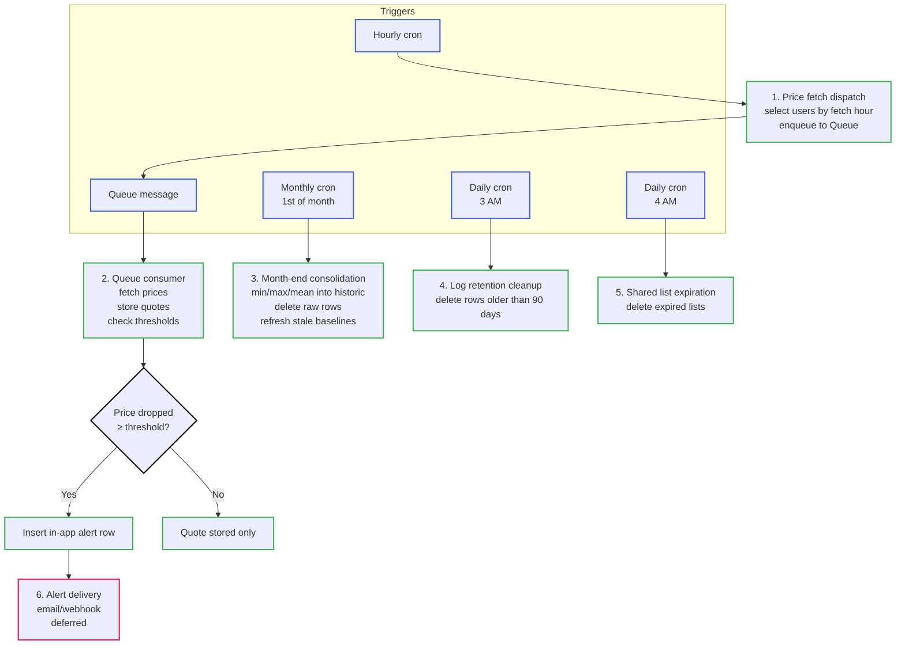

# Scheduled flows

This is the canonical list of TomeTrove's automatic (background) flows — tasks that run without user interaction, triggered by time or events. In a traditional server deployment these would be crontab entries and queue workers; on Cloudflare Workers they are [Cron Triggers](https://developers.cloudflare.com/workers/configuration/cron-triggers/) and [Queue consumers](https://developers.cloudflare.com/queues/). For the rationale behind each flow, see the linked ADRs.

## Flow summary

| # | Flow                                                                | Trigger                | Source ADR                                                      | Status   |
|---|---------------------------------------------------------------------|------------------------|-----------------------------------------------------------------|----------|
| 1 | [Hourly price fetch dispatch](#1-hourly-price-fetch-dispatch)       | Cron, hourly           | [ADR 0014](../explanation/adr/0014-scheduled-price-fetching.md) | Planned  |
| 2 | [Queue consumer: price fetch](#2-queue-consumer-price-fetch)        | Queue message          | [ADR 0014](../explanation/adr/0014-scheduled-price-fetching.md) | Planned  |
| 3 | [Month-end consolidation](#3-month-end-consolidation)               | Cron, monthly          | [ADR 0014](../explanation/adr/0014-scheduled-price-fetching.md) | Planned  |
| 4 | [Log retention cleanup](#4-log-retention-cleanup)                   | Cron, daily            | [ADR 0023](../explanation/adr/0023-logging-and-monitoring.md)   | Planned  |
| 5 | [Shared list expiration cleanup](#5-shared-list-expiration-cleanup) | Cron, daily            | [Data model](data-model.md#list)                                | Planned  |
| 6 | [Alert delivery (email/webhook)](#6-alert-delivery-emailwebhook)    | Post-fetch side effect | [ADR 0015](../explanation/adr/0015-alert-delivery.md)           | Deferred |

## 1. Hourly price fetch dispatch

**Trigger**: Cron Trigger, fires every hour.
**Source**: [ADR 0014](../explanation/adr/0014-scheduled-price-fetching.md).

The cron tick selects all users whose `user_next_fetch_hour` equals the current hour (assigned round-robin 0–23 when the user elects their first monitored book). For each selected user, it filters actionable stores ([ADR 0013](../explanation/adr/0013-store-integration-architecture.md): per-user capability filtering) and enqueues one message per `(user_id, book_id, edition_id, store_binding)` pair to the price-fetch Queue.

```
Hourly Cron Trigger
│
├── SELECT users WHERE next_fetch_hour = current_hour
│
├── for each user:
│   ├── filter actionable stores (ADR 0013)
│   └── for each monitored book × actionable store × acceptable edition:
│       └── enqueue (user_id, book_id, edition_id, store_binding) to Queue
│
└── done — cron exits; Queue consumers do the work
```

**Scale**: ~100 users/hour × 5 books × 5 stores = 2,500 messages/day, spread across 24 hours. Well within free-tier limits (5 cron slots, 15 min wall time).

## 2. Queue consumer: price fetch

**Trigger**: Queue message arrival (batch of up to 100).
**Source**: [ADR 0014](../explanation/adr/0014-scheduled-price-fetching.md).

The consumer processes each message in the batch:

```
Queue consumer (batch ≤ 100 messages)
│
├── for each message:
│   ├── call store Worker.fetchPrice(edition) via service binding (ADR 0013)
│   ├── store price_quote row in TiDB
│   ├── compare to baseline:
│   │   ├── if price dropped ≥ user threshold (default 5%):
│   │   │   └── insert alert row (in-app, always)
│   │   └── if no drop: quote stored only (visible in-app)
│   └── on error: mark message for retry (Queue handles retries, up to 100)
│
└── batch complete
```

**Cooldown**: on-demand fetches (user-triggered, not this flow) are subject to a 1-hour cooldown per `(edition_id, store_id)`. Scheduled fetches bypass the cooldown — they always fetch fresh.

**Logging**: each batch logs `fetch_started` (book count, store count) and `fetch_completed` / `fetch_failed` to the `log` table via the Logging Worker ([ADR 0023](../explanation/adr/0023-logging-and-monitoring.md)).

## 3. Month-end consolidation

**Trigger**: Cron Trigger, fires on the 1st of each month.
**Source**: [ADR 0014](../explanation/adr/0014-scheduled-price-fetching.md).

Consolidates the previous month's raw `price_quote` rows into `price_quote_historic` (min, max, mean per `(edition_id, store_id, month)`), then deletes the raw rows for that month. Baseline quotes (`price_quote_is_baseline = true`) are preserved — they are used for alert notifications, not for historic trends.

This job also refreshes stale baselines: for any monitored wish where `wish_baseline_refreshed_at` is older than 12 months, the baseline is recalculated as the mean of the most recent 12 months of `price_quote_historic` data, and `wish_baseline_refreshed_at` is updated. This corrects for inflation and list-price drift on long-tracked books.

```
Month-end Cron Trigger
│
├── for the previous month:
│   ├── SELECT raw price_quote rows grouped by (edition_id, store_id)
│   ├── compute min, max, mean per group
│   ├── INSERT into price_quote_historic (type = min/max/mean)
│   └── DELETE raw price_quote rows for that month
│       (preserve rows where is_baseline = true)
│
├── refresh stale baselines:
│   ├── SELECT wishes WHERE is_monitored = true
│   │   AND baseline_refreshed_at < now - 12 months
│   ├── for each: recompute baseline = mean of last 12 months historic
│   └── UPDATE wish.baseline_refreshed_at = now
│
└── done
```

**Logging**: logs `consolidation_started` (month), `consolidation_completed` (rows processed, duration), or `consolidation_failed` (error) to the `log` table ([ADR 0023](../explanation/adr/0023-logging-and-monitoring.md)).

## 4. Log retention cleanup

**Trigger**: Cron Trigger, fires daily.
**Source**: [ADR 0023](../explanation/adr/0023-logging-and-monitoring.md).

Deletes rows from the `log` table older than the retention period (default 90 days, configurable via environment variable). This prevents the log table from growing unbounded.

```
Daily Cron Trigger
│
├── DELETE FROM log WHERE log_time < now - 90 days
│
└── done
```

This job is run by the Logging Worker, not the main Worker — the Logging Worker owns the `log` table.

## 5. Shared list expiration cleanup

**Trigger**: Cron Trigger, fires daily.
**Source**: [Data model — List](data-model.md#list).

The `list` table has an optional `list_expiration_date` field. If set, the list should be auto-deleted after that date. This is also checked on user access (lazy cleanup), but the daily cron ensures expired lists are removed even if the owner never logs in again.

```
Daily Cron Trigger
│
├── DELETE FROM list WHERE list_expiration_date IS NOT NULL
│   AND list_expiration_date < today
│
└── done
```

## 6. Alert delivery (email/webhook)

**Trigger**: Side effect of the price-fetch Queue consumer (flow 2), when a threshold is crossed.
**Source**: [ADR 0015](../explanation/adr/0015-alert-delivery.md).
**Status**: Deferred — only in-app notifications are implemented in the current phase.

When implemented, this flow sends alerts through user-configured external channels (email via Cloudflare Email Service or external provider; webhook via `fetch()` to a user-configured URL). The in-app alert row is always created (flow 2); this flow adds the external delivery on top.

```
Post-fetch (within Queue consumer, after alert row is created)
│
├── if user has email alerts enabled:
│   └── send email (Cloudflare Email Service or external provider)
│
├── if user has webhook alerts enabled:
│   └── POST alert payload to user-configured URL
│
└── done
```

**Logging**: logs `alert_sent` (user ID, book ID, channel, threshold) or `alert_failed` (user ID, error) to the `log` table ([ADR 0023](../explanation/adr/0023-logging-and-monitoring.md)).

## Cron Trigger inventory

TomeTrove uses the following Cron Triggers (max 5 on the free tier):

| Cron expression                      | Flow                         | Worker         |
|--------------------------------------|------------------------------|----------------|
| `0 * * * *` (hourly)                 | Price fetch dispatch (#1)    | Main Worker    |
| `0 0 1 * *` (1st of month, midnight) | Month-end consolidation (#3) | Main Worker    |
| `0 3 * * *` (daily, 3 AM)            | Log retention cleanup (#4)   | Logging Worker |
| `0 4 * * *` (daily, 4 AM)            | Shared list expiration (#5)  | Main Worker    |

One slot remains free for future use.

## Flow diagram


